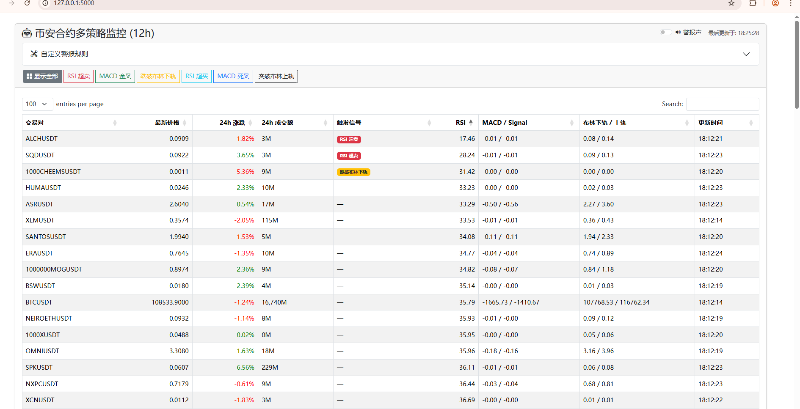

# 币安合约多策略实时监控面板


这是一个基于 Python Flask 和 `pandas-ta` 构建的Web应用，旨在实时监控币安（Binance）永续合约市场，通过多种预设及可自定义的技术分析策略，帮助用户发现潜在的交易机会。

## 🚀 运行截图 (Live Demo)



## ✨ 功能特性

- **全市场实时扫描**: 自动获取币安所有 USDT 永续合约并进行监控。
- **高性能数据采集**: 后端采用多线程并发处理，大幅缩短数据初始化和更新时间。
- **丰富的数据展示**: 表格包含最新价格、24小时涨跌幅、24小时成交额等关键信息。
- **预设策略筛选**: 内置六种常用技术分析策略，可一键筛选符合条件的币种：
  - `RSI 超卖` (< 30)
  - `RSI 超买` (> 70)
  - `MACD 金叉`
  - `MACD 死叉`
  - `跌破布林下轨`
  - `突破布林上轨`
- **强大的自定义规则引擎**:
  - 用户可自由组合**指标** (`价格`, `RSI`, `MACD线`)、**条件** (`>`, `<`) 和**目标** (`自定义数值`, `布林带上/下轨`, `MACD信号线`) 创建个性化警报。
- **交互式前端界面**:
  - 使用 `DataTables.js` 实现表格的**即时搜索**、**点击排序**和**分页**功能。
- **双重视觉警报**:
  - 符合预设策略的币种以**红色**高亮。
  - 符合自定义规则的币种以**蓝色**高亮。
- **可开关声音警报**: 当有新的币种触发任一警报条件时，会播放提示音，该功能可随时开启或关闭。

## 🛠️ 技术栈

- **后端**: Python, Flask, Pandas, Pandas TA, Requests
- **前端**: HTML, Bootstrap 5, jQuery, DataTables.js
- **并发模型**: `concurrent.futures.ThreadPoolExecutor`

## 🔧 安装与启动

请确保您的系统已安装 Python 3.8+。

**1. 克隆仓库**
```bash
git clone https://github.com/BingoCrypto/binance-futures-dashboard.git
cd binance-futures-dashboard
```

**2. 创建并激活虚拟环境 (推荐)**
- **Linux / macOS**:
  ```bash
  python3 -m venv .venv
  source .venv/bin/activate
  ```
- **Windows**:
  ```bash
  python -m venv .venv
  .venv\Scripts\activate
  ```

**3. 安装依赖**

```bash
pip install -r requirements.txt
```
*(如果您的 `numpy` 版本与 `pandas-ta` 冲突，请自行搜索解决方案)*

**4. 放置警报声音文件**
在项目根目录下创建一个名为 `static` 的文件夹，并将您选择的警报声音文件命名为 `alert.mp3` 放入其中。

**5. 运行应用**
```bash
python app.py
```
终端会显示服务正在运行，通常在 `0.0.0.0:5000`。

**6. 访问仪表盘**
打开您的浏览器，访问 `http://127.0.0.1:5000`。首次加载时，后端需要几分钟时间完成第一次全市场扫描，请耐心等待。

## 📖 如何使用

- **预设策略筛选**: 点击页面顶部的一排彩色按钮（如“RSI 超卖”、“MACD 金叉”），表格将立即筛选出符合该条件的币种。再次点击“显示全部”可恢复。
- **自定义警报规则**:
  1. 点击“自定义警报规则”将其展开。
  2. 点击“启用”开关。
  3. 依次选择您想要的指标、条件和比较目标/数值。
  4. 设置完成后，表格中符合您自定义规则的行将以蓝色高亮显示。
- **声音警报**: 点击页面右上角的“警报声”开关，即可开启或关闭声音提示。
- **表格交互**:
  - 使用右上角的**搜索框**可以快速查找特定币种。
  - 点击**表头**（如“RSI (12h)”、“24h 涨跌”）可以对整个列表进行排序。

## 📁 项目结构
```
bnhy/
├── app.py              # Flask后端主程序
├── requirements.txt    # Python依赖包列表
├── static/
│   └── alert.mp3       # 警报声音文件
└── templates/
    └── index.html      # 前端页面模板
```

## ⚠️ 免责声明

本项目仅用于技术学习和研究目的，所有数据和信号均来自币安API，可能存在延迟或错误。所有监控结果**不构成任何投资建议**。据此操作，风险自负。

## 📄 许可证 (License)

本项目采用 [MIT License](https://opensource.org/licenses/MIT) 授权。